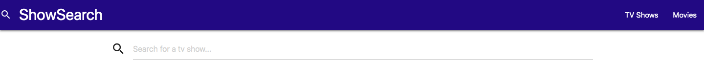
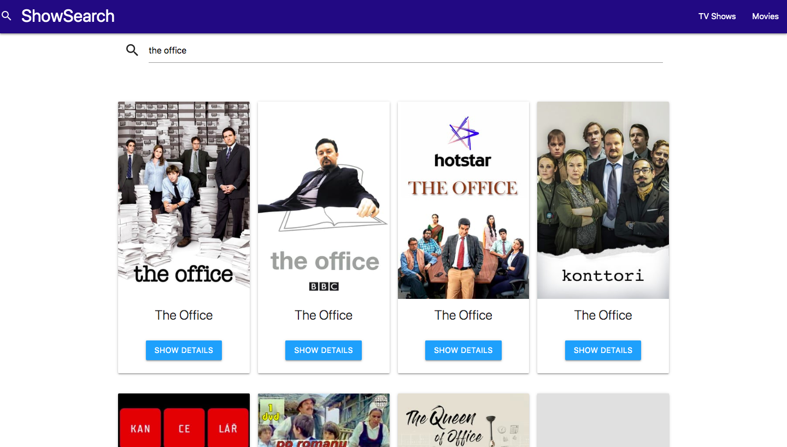

# ShowSearch

## Description

ShowSearch is a web app created as a solution to a prompt for Bloc's final certification process. At a minimum, the app needed to be built to the following specifications:

* Must be a full-stack application with a backend that communicates with the movie API.

* The front-end should be intuitive to use

* The code must be accompanied with a full test suite

* Deploy the site to a web host

* When first loaded, there should be a list of popular TV shows and a search bar.

* Upon searching for a TV show in the search bar, the user should see a list of shows whose title matches the search.

* After clicking on a TV show, the user should be taken to a page with more information about that particular TV show.

## Implementation

Because the app needed to be considered "full-stack", I chose to implement my solution using Ruby on Rails. However, since the app was using an API to fetch data from another service, I opted to create a Rails app without a database, since there was no need to create users or any other actions that would require persistence to a database.

RubyGems provide an easy way to add functionality to an app, so the popular `HTTParty` gem was used to aid in fetching data from the Tmdb API.

The front-end was styled using MaterializeCSS as it provides a quick and easy way to add styling to an app. Although, due to the nature of displaying collections of cards using MaterializeCSS, some custom CSS was added in order to keep things looking clean.

The app is tested using RSpec because it provides an intuitive set of methods for testing the functionality of the program. Since data was only fetched with this app and not created, RSpec was used to test the returned values from the API client.

## Usage

The use of ShowSearch is simple, at the top of either the `TV Shows` or `Movies` page, a search bar is displayed.

Simply enter the title of the show or movie for which you would like to see more information and the app will return a list of shows based on the query.

## Additional Features

Due to the similarities between the two features, a `Movie Search` is provided in addition to the `TV Search` allowing users to display Movies based on a search for their Title.

## Going Forward

Given more time to spend on the project, I believe it would've been nice to add the following features:

* **Pagination for popular TV Shows/Movies** - In it's current configuration, the index pages for both TV and Movies only display the first page of popular content returned from the Tmdb API. Given more time to figure out it's implementation, I think it would be nice to add pagination so that users can sift through additional pages of popular content.
